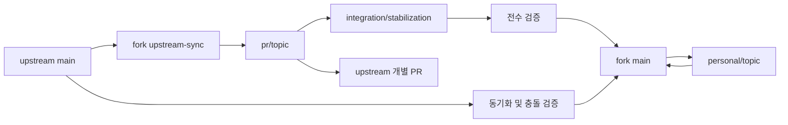

# Upstream 기여와 개인 fork 운영 설계

작성일: 2026-09-08. 상태: 설계 완료, 아래 브랜치/CI/기능 변경은 아직 실행하지 않음.

이 문서는 [기존 리뷰](REVIEW_AND_PR_PLAN.ko.md)의 운영·순서 부분을 보강하며, 충돌할 경우 이 문서를 따른다. 사용자가 요청한 최종 방향은 오류 수정과 기능 향상을 구현해 `kimdongup/quickgui`에 push하며 관리하고, upstream에 기여할 부분을 분리하는 것이다. 이번 단계의 산출물은 보강된 설계다. 실제 구현 단계에서는 이미 요청된 fork push를 작업 단위로 진행하며 매번 같은 허락을 다시 받는 절차를 두지 않는다. upstream PR 제출은 검증 완료 후 준비된 개별 변경으로 진행할 예정이다.

## 1. 제품과 완료 기준

두 개의 코드베이스를 복사해 관리하지 않는다. 공통 안정화 코드를 공유하고, 개인용에 추가된 부분만 별도 변경으로 유지한다.

| 구분 | PR 요청용 | 개인용 |
| --- | --- | --- |
| 목적 | 기존 사용자의 정상 동작 복구와 유지보수 가능한 개선 | 검증된 공통 수정 + 개인 환경/고급 기능의 지속 관리 |
| 기준 | 제출 시점의 upstream main, 공개 배포 Quickemu | 동일 공통 수정, 필요하면 개인 Quickemu 확장과 명시적 호환성 |
| UI | 기존 화면 구성·색·메뉴·기본 조작 흐름 유지 | 같은 기본 UI 유지, 후속 기능을 기존 화면 안에 추가 |
| 내용 | F1–F10, 기존 기능 전수 점검에서 발견된 오류, 스크롤·접근성·오류 표시 | 새 VM 이동/강조, 안전한 config 편집, 선택형 고급 설정, 독립 배포 |
| 완료 | 구현과 해당 테스트 완료 후 별도 전수 검증까지 통과 | 공통 검증 통과 + 개인 기능 테스트 및 배포 검증 통과 |
| upstream 미수용 | 거절 원인과 유지할 수정 기록 | 기능을 유지하고 upstream 이후 변경과 계속 통합 |

새 기능도 범위가 작고 기존 UI에 맞으면 후속 PR 후보가 된다. 개인용이라는 이유만으로 오류 수정을 개인 브랜치에 가두지 않는다. “모든 기능 향상”은 기존 리뷰의 A–G 및 아래 기능 목록을 작업으로 등록하고 끝까지 처리한다는 범위다. 검토 중 발견한 추가 결함도 등록하며, 무관한 신규 제품 기능까지 무한히 추가하는 뜻으로 해석하지 않는다.

진행 상태는 **설계 완료 → 구현 완료 → 검증 완료 → fork 반영 → PR 제출 → upstream 반영/개인 유지**로 구분한다. 코드가 컴파일됐다고 검증 완료로 기록하지 않는다.

## 2. remote와 브랜치 구조

현재 로컬 `origin`은 upstream이다. 구현 시작 시 기존 수정분과 remote 설정을 보존한 뒤 다음 이름으로 정리한다. 이는 기존 리뷰의 `origin=upstream, fork=개인` 제안을 대체한다.

```text
upstream  https://github.com/quickemu-project/quickgui.git  # 읽기/비교 기준
origin    https://github.com/kimdongup/quickgui.git         # 작업 push 대상
```

이름 전환은 기존 origin을 upstream으로 rename하고 fork를 origin으로 추가하는 방식이다. 이미 같은 remote가 있으면 URL을 확인해 재사용한다. push는 `git push origin <branch>`처럼 목적지를 명시한다.

| fork 내 브랜치 | 역할 | 허용 변경 |
| --- | --- | --- |
| `upstream-sync` | upstream main의 마지막 확인 사본 | 직접 커밋 없음, upstream에서 fast-forward 동기화만 |
| `pr/<topic>` | upstream에 제출할 최소 변경 | 공통 오류 수정/기반 변경과 그 테스트·문서 |
| `integration/stabilization` | PR용 전체 구현을 모아 전수 검증 | `pr/*` 통합과 검증용 CI. 개인 기능은 넣지 않음 |
| `main` | 개인용 안정판 및 기본 브랜치 | 검증을 통과한 공통 수정 + 승인된 개인 기능 |
| `personal/<topic>` | 개인 기능 개발 | main에서 분기, 기존 UI에 맞춘 기능·배포 변경 |
| `archive/local-start` | 최초 미커밋 수정의 복구 지점 | 재구성 전 1회 보존. 정리되지 않은 코드를 제품 기준으로 삼지 않음 |



PR topic의 테스트 결과와 통합 검증 결과를 모두 확인한 뒤 제출한다. 제출 대상은 `pr/<topic>`이며 `main`이나 통합 브랜치를 통째로 upstream PR head로 사용하지 않는다.

로컬은 PR 구현/통합 검증/개인 기능에 별도 worktree를 사용해 같은 디렉터리에서 잦은 checkout을 피한다. 브랜치는 같은 Git 객체를 공유한다. VM 데이터는 worktree 밖의 명시적 디렉터리에 두어 소스 checkout과 독립시킨다.

### 이력 공유와 충돌 처리

1. 가능한 한 동일 공통 커밋을 `pr/* → integration → main`으로 merge한다. 같은 수정의 복사 구현이나 습관적인 중복 cherry-pick을 피한다.
2. 의존성 없는 PR은 upstream-sync에서 독립 분기한다. 공통 ProcessRunner 등 선행 코드가 필요한 경우 의존 관계를 기록하고, 선행 PR 병합 후 후속 PR base를 갱신한다. 통합 테스트를 위해 합쳤다는 이유로 모든 PR을 하나의 거대한 diff로 만들지 않는다.
3. 개인 환경에서 발견한 공통 결함은 upstream-sync 또는 필요한 공통 기반에서 수정 커밋을 만들고 양쪽에 반영한다. 개인 기능을 포함한 main에서 upstream용 수정 전체를 분기하지 않는다.
4. 공유 main에는 upstream을 통합하는 별도 `sync/<date>` 브랜치를 만들어 검증 후 merge한다. main 및 공개 릴리스 이력은 rebase/force push하지 않는다.
5. upstream이 squash/rebase merge하면 SHA가 달라진다. PR 상태, 실제 tree diff, 필요시 patch-id/range-diff로 같은 수정이 반영됐는지 확인한다. SHA가 다르다는 이유만으로 재적용하거나 patch-id만 믿고 필요한 보완을 삭제하지 않는다. [GitHub 병합 방식 설명](https://docs.github.com/en/pull-requests/reference/pull-request-merges).
6. 공개 `pr/*`는 기본적으로 후속 수정 커밋으로 갱신한다. 제출 전 임시 브랜치 정리와 이미 공유한 브랜치 재작성은 구분한다. 선행 squash 이후 복잡해지면 새 topic에서 남은 변경만 재구성하고 검증한다.

## 3. 구현 순서

| 단계 | 작업 및 산출물 | 다음 단계로 넘어가는 조건 |
| --- | --- | --- |
| S0 보존/기준선 | 초기 수정 patch와 신규 파일 보존, 추적할 파일 선별, remote 정리, 기능 목록 및 화면 기준선 기록 | 원본 복구 가능, PR/개인 worktree 분리, 기본 CI 실행 가능 |
| S1 빌드 기반 | A: Flutter/Dart/의존성/Nix/macOS SDK 정합성, 직접 dependency 정리, 분석 info 8건 해결, 테스트 CI | 선택한 최소/주 검증 SDK에서 의존성 해결·분석·테스트 수행 가능 |
| S2 PR용 구현 | B–E: 초기화·경로·도구 발견·목록·다운로드·VM 작업·스크롤, 공통 runner/controller 및 필요한 회귀 테스트 | F1–F10와 추가 공통 결함의 구현 및 각 topic 테스트 완료 |
| S3 기능 전수 검증 | 아래 QA 문서의 정상/오류/취소/경쟁/재시작/플랫폼/시각 검증, 발견 결함을 소유 topic에 수정 | PR 후보별 정확한 SHA와 통합 SHA의 검증 기록 완료, 필수 항목 미실행/실패 없음 |
| S4 PR 준비/개인 안정판 | topic별 fork push 및 CI 확인, 영문 PR 본문/변경 전후 재현/참고 PR·저작자 기록, 공통 안정화를 main에 반영 | 개인 전용 diff가 PR에 없고 실제 검증 결과가 설명과 일치 |
| S5 개인 기능 구현 | F/G, 선택형 고급 설정과 개인 배포, 기능별 topic을 main에 반영 | 공통 QA 회귀 없음 + 해당 기능 수용 조건 통과 |
| S6 계속 운영 | upstream 리뷰 반영, 수용/보류/거절 추적, 정기 동기화, 양쪽에 공통 수정 전달 | 각 동기화/릴리스의 빌드·테스트·호환성 기록 |

fork push는 S4에서 처음 시작하는 것이 아니다. S0 이후 로컬 검증을 마친 작업 단위로 topic을 push해 이력과 CI를 관리한다. S4는 제출할 커밋을 확정하는 단계다. 초기 archive에는 인증정보·빌드 출력·VM 파일을 넣지 않고 소스 수정의 복구에 필요한 파일만 보존한다. `.DS_Store`는 로컬 백업에 보존할 수 있으나 제품 커밋에는 넣지 않는다.

처음부터 새 기능을 끼워 넣어 안정화 검증 범위를 늘리지 않는다. **PR용 구현 완료 후 S3를 독립 단계로 수행**하고, 버그가 나오면 S2에 돌아가 수정한 다음 영향을 받는 QA를 다시 수행한다. upstream 응답을 기다리느라 개인용 구현을 정지시키지 않는다.

## 4. 기능별 소유 범위와 UI 유지 규칙

| 작업 ID | 기능 | 1차 대상 | 구현 범위 |
| --- | --- | --- | --- |
| CORE-01 | 도구 발견·시작·아이콘·앱/Quickemu 버전 | PR | 패키지 정보 조회와 도구 설치 여부를 분리하고 실패 원인을 표시 |
| CORE-02 | 저장 경로와 설정 | PR | null/삭제/외장 볼륨/권한 오류 복구, 쓰기 가능한 작업 경로 고정, 기존 설정 보존 |
| CORE-03 | OS/버전/옵션 목록 및 검색 | PR | CSV 호환, 조회 실패/빈 목록, 단일 스크롤, 옵션 없음/null 계약 정리 |
| CORE-04 | 다운로드·취소·완료·알림 | PR | 출력 소비, 종료 상태 모델, 프로세스 트리 취소 검증, UI/알림 결과 일치 |
| CORE-05 | VM 목록·시작·중지·삭제 | PR | 절대 config 경로, 상태 파일 위치 계약, 작업 잠금, 오류/경쟁/갱신 처리 |
| CORE-06 | SSH·SPICE | PR | port 검증, timeout/정리, 안전한 인자 전달, 클라이언트 없음/실패 표시 |
| CORE-07 | 테마·언어·내비게이션·접근성 | PR | 저장/재시작 유지, 잘못된 locale fallback, 화면 생명주기, 키보드/긴 경로 |
| CORE-08 | 빌드·패키지・호환성 | PR | 공개 Quickemu와의 계약, Linux/macOS 검증, lockfile 정합성, fork에서도 가능한 검증 CI |
| EXT-01 | 다운로드 후 새 VM 이동/강조 | 개인 우선, 후속 PR 후보 | #275 아이디어, 성공한 config만 전달, 시간순 폴더 추정 제거 |
| EXT-02 | 중지된 VM의 config 편집 | 개인 우선, 후속 PR 후보 | #266 기반, 로딩/저장 상태·충돌 확인·원본 보존·작업 잠금 |
| EXT-03 | 고급 실행 설정 | 개인 우선 | 사용자가 선택한 backend 경로와 display/sound/architecture override. 지원 capability에만 노출하고 기존 기본값 유지 |
| OPS-01 | 개인 패키지/릴리스와 동기화 | 개인 | fork 식별, 자체 GitHub Release, upstream 기능/커밋 대응표 |

PR용에서 유지할 시각 기준은 현재 홈·Downloader·Manager·설정 drawer의 구성, 색상, 아이콘 의미, 주요 버튼 순서다. 플랫폼마다 다른 디자인 시스템으로 바꾸거나 화면 전체를 재배치하지 않는다.

오류 문구/재시도, 작업 중 spinner·비활성화, 스크롤바, 긴 경로 ellipsis/tooltip, 키보드 focus, 번역 누락 보완은 정상 동작을 위한 수정으로 허용한다. 오류 표시를 위해 기존 dialog/화면 영역을 사용한다. 옵션을 늘린 새 화면과 추가 주요 버튼은 개인 기능 단계에서 다룬다. SDK 업데이트로 기본 테마/간격이 바뀌면 기존 화면 기준선과 비교해 필요한 스타일을 명시한다.

수정 후 정상 상태의 화면이 불필요하게 달라지지 않았는지 확인하면서, 이전의 잘못된 완료 표시·잘린 텍스트·비활성 오류까지 보존하지는 않는다. 기준선은 기존 정상 UI이고 결함 화면은 회귀 기대값이 아니다.

## 5. 공통 내부 구조의 구체화

[기존 설계](REVIEW_AND_PR_PLAN.ko.md)의 다섯 계층을 사용하며 새로운 상태 관리 프레임워크 도입은 필수로 하지 않는다. 위젯은 표시와 사용자 이벤트를 담당하고 파일/프로세스 작업은 주입 가능한 서비스가 담당한다.

- `ToolchainStatus`는 quickget/quickemu별 발견 경로·버전·실행 오류·지원 기능을 담는다. `PackageInfo` 성공 여부를 설치 여부로 쓰지 않는다. 현재 `app.dart`가 packageInfo null을 도구 미설치로 표시하는 결합도 CORE-01에서 해소한다.
- `WorkspaceRef`는 절대 경로와 선택 세대를 갖는다. 작업/VM ID에 이를 포함하고 이전 화면에서 시작된 작업 결과가 새 workspace를 덮어쓰지 않게 한다. preference 저장 실패를 숨기지 않는다.
- `CommandResult`는 exitCode, 제한된 stdout/stderr, 시작 실패/timeout/cancel 원인을 담는다. 일반 명령 timeout과 장시간 다운로드/VM 수명은 서로 다르다. 다운로드 전체에 짧은 고정 timeout을 적용하지 않는다.
- `DownloadSession`은 프로세스/구독/취소 상태를 소유한다. 취소 요청 직전 프로세스가 성공한 경쟁에서도 성공·취소가 모순되지 않게 전이 규칙을 테스트한다. start 중 취소 요청도 유실하지 않는다.
- `VmController`는 VM별 명령을 직렬화하되 서로 다른 VM은 독립 진행한다. UI 잠금만으로 외부 quickemu 명령을 막을 수 없으므로 파괴적 작업 직전 backend 상태도 재검증한다. 상태 확인 실패 시 unknown을 stopped로 바꾸지 않는다.
- 종료 정책: 이미 실행된 VM은 GUI를 닫아도 계속 실행한다. 다운로드 중 창 종료는 기존 스타일의 대화상자로 취소/종료를 선택하고, 취소하기로 한 세션과 그 자식만 종료한다. 관련 없는 curl/QEMU 프로세스를 이름으로 일괄 종료하지 않는다.
- config는 Bash 파일임을 유지한다. 상태 조회/편집 UI가 config를 source하지 않는다. 계산식·동적 경로를 해석할 수 없으면 명시적 미지원/unknown으로 반환한다. 실제 VM 실행은 사용자가 지정한 Quickemu의 기존 config 처리 계약을 따른다.

PR용 테스트는 공개 배포 Quickemu의 선택한 최소 지원 버전과 주 검증 버전을 pin한다. 부모 디렉터리의 수정된 Quickemu로만 성공하는 기능은 EXT-03 또는 별도 Quickemu 기여로 추적한다. Quickgui에 없는 backend 기능을 GUI만으로 구현된 것처럼 표시하지 않는다.

## 6. CI와 릴리스 운영

현재 build workflow는 main 및 pubspec.yaml/assets/lib/linux 경로 위주이며 tests/macos/lockfile/workflow 변경을 놓칠 수 있다. PPA 빌드 job에도 upstream 전용 secret이 들어 있다. publish workflow의 FlakeHub 대상 이름은 `quickemu-project/quickgui`로 고정돼 있어 개인 fork에서 그대로 사용할 운영 설정이 아니다.

설계:

1. `ci.yml`: secret 없이 format/analyze/test, Linux/macOS build. fork의 `pr/**`, `integration/**`, `personal/**`, main push 및 관련 PR을 대상으로 한다. PR 기준 브랜치 필터와 push head 필터를 구분한다.
2. 필수 검사 workflow는 경로 필터 때문에 통째로 누락되지 않게 한다. 무거운 build만 변경 감지 또는 job 조건으로 분리하고 테스트·macOS·lockfile·Nix·workflow 변경을 모두 고려한다. 정적 분석 오류를 제외 규칙으로 감추지 않는다.
3. Nix/패키징 job은 해당 변경 및 릴리스 후보에서 실행한다. fork PR에서도 secret 없이 패키지 생성 검증이 가능하도록 서명/배포와 분리한다.
4. upstream PPA/FlakeHub job은 upstream repository와 적절한 release event 조건에서만 실행한다. 개인 fork는 자체 GitHub Release workflow를 사용하고 upstream의 배포 대상/secret에 의존하지 않는다.
5. 코드 검증은 `pull_request` 기반이다. 기존 `pull_request_target` 제목 lint는 메타데이터 처리만 하며 PR head 코드를 checkout/실행하도록 확장하지 않는다. fork PR에는 일반 secret이 전달되지 않는 제약을 반영한다. [GitHub 이벤트 문서](https://docs.github.com/en/actions/reference/workflows-and-actions/events-that-trigger-workflows#pull_request).
6. main/통합 브랜치에는 통과한 검사 결과를 요구하는 운영 규칙을 적용한다. 개인 환경에서 해당 플랫폼 검사를 수행할 수 없으면 CI/별도 runner 결과를 기록하고 미실행을 통과로 바꾸지 않는다. 권한 설정은 실제 적용 여부를 별도 기록한다.
7. 개인 릴리스는 `fork-vX.Y.Z.N`처럼 upstream 태그와 구분하고 pubspec의 유효한 버전 및 패키지 메타데이터와의 매핑을 릴리스 스크립트 한 곳에서 관리한다. 초기 구체 버전은 첫 배포 때 결정한다. 현재 Nix 버전 파서도 이 정책과 함께 검증한다.
8. 태그 push와 수동 release는 동일한 정확한 tag/SHA를 checkout하고 검증·빌드·업로드해야 한다. 현재 `inputs.tag`, `git describe`, `${{ github.ref }}` 혼용을 정리한다. 산출물 존재 검사는 기대 파일명/개수로 하고 현재의 개수 `< 0` 비교를 교체한다.
9. 릴리스 산출물은 checksum, 소스 SHA, SDK/Quickemu 호환 버전, 변경 내역, 미검증 플랫폼을 포함한다. 일반 branch push는 배포를 실행하지 않는다.

앱을 동시에 설치할 필요가 생기면 개인 macOS bundle ID/Linux desktop ID와 설정 저장소를 분리한다. 기존 설정 가져오기는 명시적 migration으로 하고 upstream 앱의 preference를 조용히 덮어쓰지 않는다. UI 모양은 유지하되 About/version과 릴리스 페이지에서 개인 빌드를 식별한다. 현재 라이선스와 기존 저작자 표시는 유지한다.

## 7. upstream 수용/보류/거절 이후

| 결과 | 처리 |
| --- | --- |
| 그대로 merge | sync 브랜치에서 반영 확인, 양쪽 테스트, 대응표에 upstream SHA 기록 |
| 일부만 수용/다른 구현 | upstream 구현과 사용자에게 필요한 결과를 비교해 중복 제거, 남는 차이만 개인 패치로 유지 |
| 리뷰 수정 요청 | 공통 결함/개선은 양쪽에 전달. upstream 정책에만 필요한 차이는 별도 커밋으로 분리 |
| 기능 범위/방향 때문에 거절 | 기능을 개인 main에서 유지하고 후속 upstream 의존성 변화에 맞춰 관리 |
| 기술적 결함 때문에 거절 | 개인용에서도 결함을 수정·재검증한 뒤 유지. 단순히 거절됐다는 이유로 불안정 코드를 계속 배포하지 않음 |
| 장기 무응답 | 개인 릴리스를 계속 운영하며 변경을 제출 가능 단위로 보존 |

독립 유지 여부는 GitHub의 fork 연결을 끊거나 새 저장소를 만들지 않아도 운영할 수 있다. main의 릴리스 주기와 기능 선택을 개인 저장소에서 관리하고 upstream 변경은 선택적으로 검증해 통합한다.

## 8. 구현 단계에서 유지할 기록

개인 운영 문서는 `docs/maintenance/`에 모으고 upstream topic에는 그 수정에 필요한 공개 문서만 넣는다. 현재 한국어 리뷰/운영 설계도 개인 운영 문서이며 모든 upstream PR에 자동으로 포함하지 않는다.

| 기록 | 필수 내용 |
| --- | --- |
| 작업 목록 | CORE/EXT/OPS ID, 원 결함 F번호, 대상 트랙, 우선순위, 의존 작업, 구현/검증/fork push 상태 |
| 변경 대응표 | topic SHA, 개인 main 반영 SHA, upstream PR/merge SHA, 참고 원 PR/저작자, 거절 이유와 남는 패치 |
| 검증 결과 | QA ID, 정확한 commit SHA, host/arch/SDK/backend 버전, 실행 명령, 예상/실제 결과, 로그/스크린샷, pass/fail/not-run |
| 릴리스 기록 | tag/SHA, 테스트 증거, 패키지 목록/checksum, 호환성, migration/되돌리기 방법 |

상세 검증 목록은 [QA 계획](FUNCTIONAL_QA_PLAN.ko.md)을 따른다. 최초 리뷰의 임시 진단 4건은 결함 재현 근거이고, 구현 후에는 정상 결과를 기대하는 정식 회귀 테스트로 전환해야 한다.
