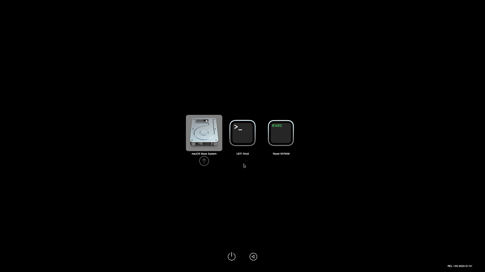
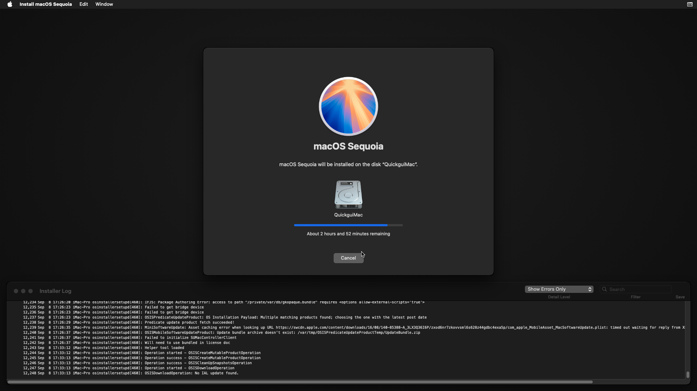
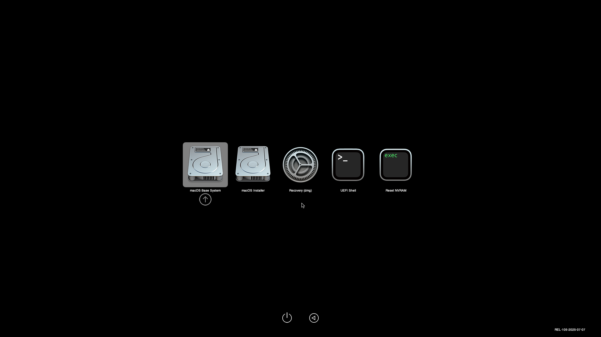
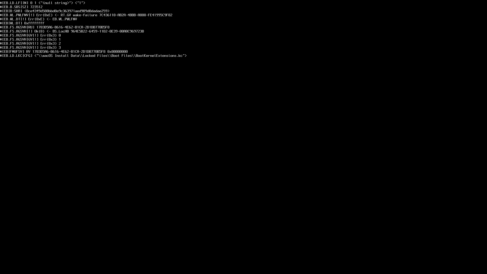
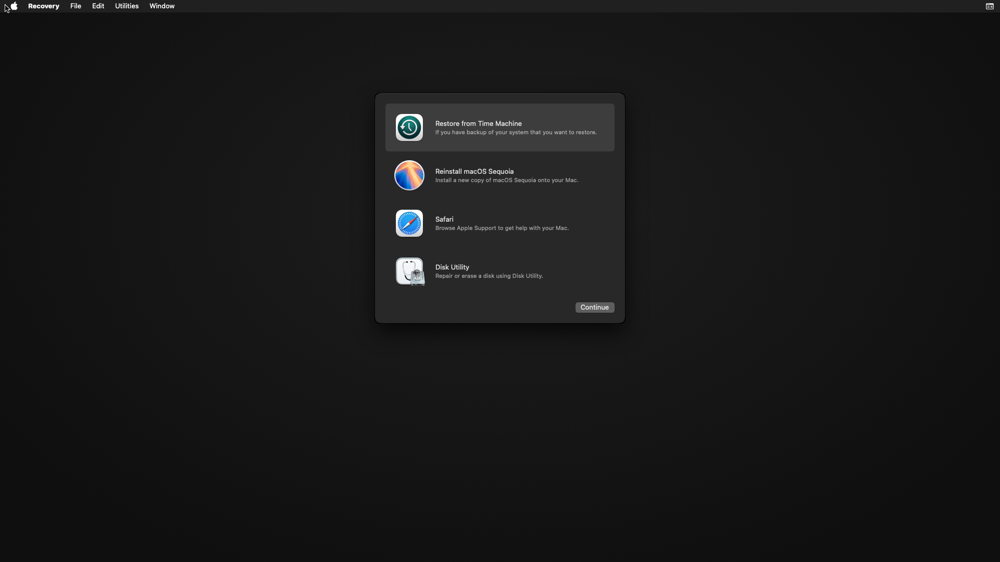
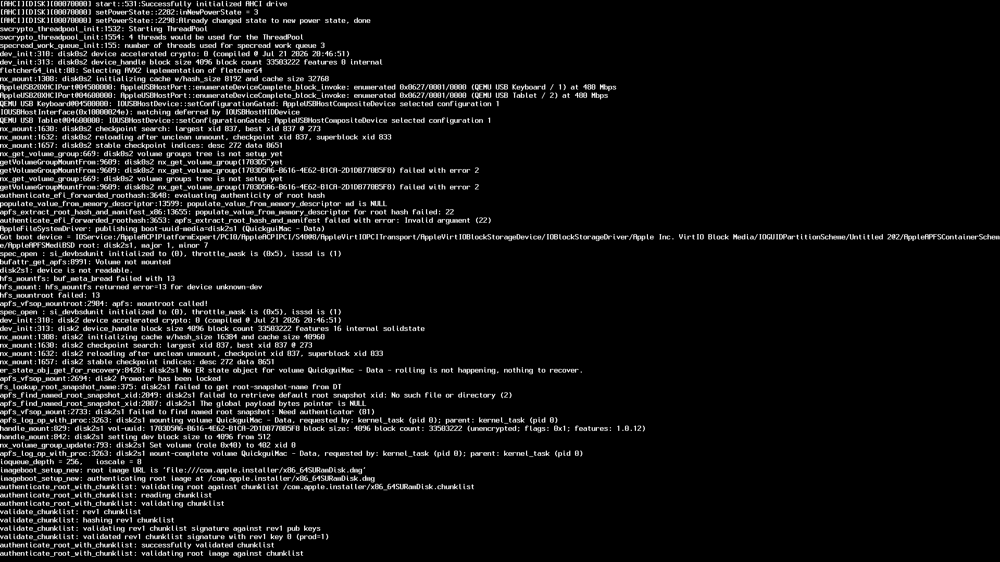
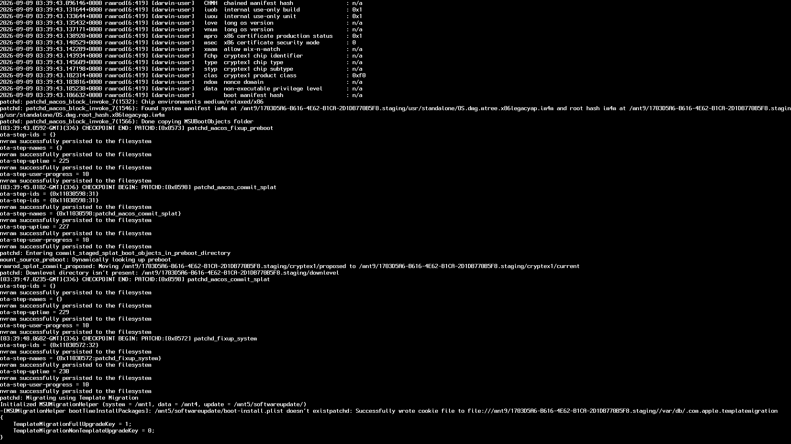
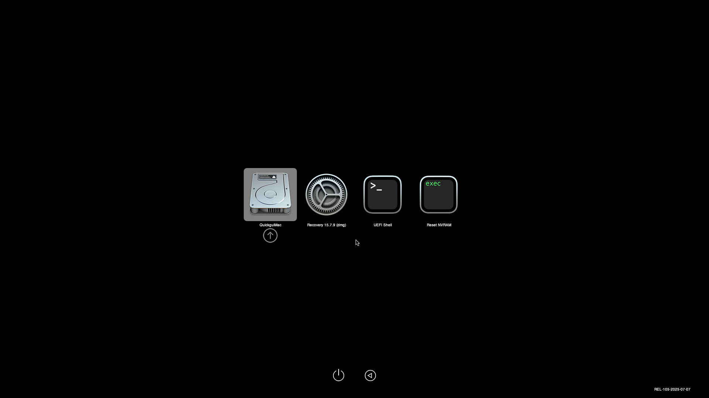
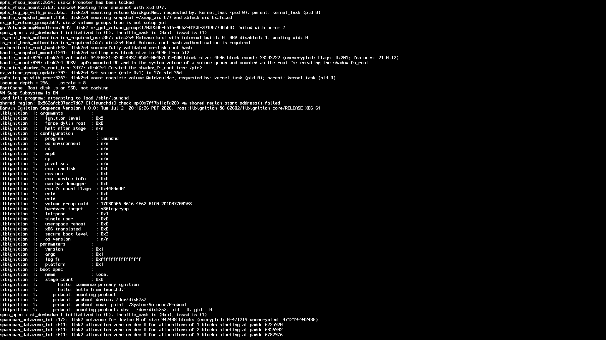
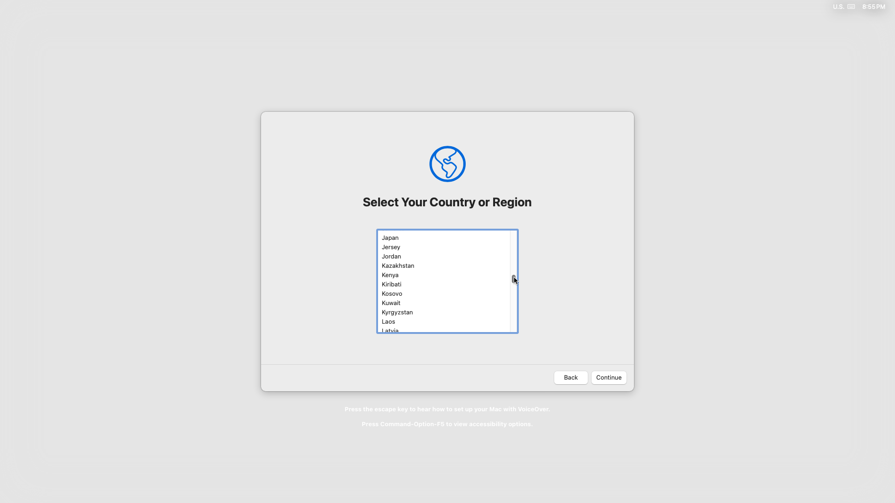

# 게스트 설치 경험과 순차 검증

2026-09-08. 코드는 개인 후보 `personal/windows-installation`에서 구현하고, 통합 후의 실사용 검증 기록은 `personal/preview`에서 이어서 관리한다. 기존 Windows 디스크·설정·설치 중 표시 파일은 읽기만 했으며, 이 작업에서 재설치하거나 표시를 해제하지 않았다.

## Windows 11 x64 경험을 앱에 반영

사용자가 `/Users/mac/quickemu`의 Windows 11 x64 설치 진행 성공을 확인했다. 9월 6일 설치 기록은 첫 설치 단계와 두 번째 단계 진행까지 기록하고 있다. 바탕화면·재부팅·SSH 로그인은 별도 확인 대상으로 남긴다. 오래된 `installation-in-progress` 파일만으로 사용자가 보고한 진행 상황을 부정하거나, 설치가 끝났다고 자동 판정하지 않는다.

| 관찰 | 앱에 반영한 동작 |
| --- | --- |
| Intel Mac에서 HVF + host CPU 설치가 중단됐고 Nehalem + HPET 조합으로 진행 | 중지된 Windows x64 VM의 편집 화면에 선택형 **Windows x64 on Intel Mac** 프로필. 변경 내용을 먼저 표시하고 **Use in editor → Save**로 저장 |
| SATA/Intel NIC 구성으로 설치 | `guest_os="windows-server"`는 Quickemu의 하드웨어 선택이며 Windows 11 Pro라는 설치 제품과 구분해 설명 |
| HVF + TPM 사용 시 EFI 정체 관찰 | 프로필은 TPM·Secure Boot를 끄는 실험 설정임을 표시. 전체 Windows 기본값으로 적용하지 않음. 요구사항 우회·인증 키·무인 응답 파일은 생성하거나 포함하지 않음 |
| 디스크 크기로 설치 완료를 추정하여 설치 중 ISO가 빠짐 | GUI는 디스크 크기·QEMU 실행 성공을 설치 완료로 취급하지 않음. 기존 `installation-in-progress`가 있으면 일반 Run을 차단하고 설치 완료 확인 절차 표시 |
| 설치 전용 실행기는 무인 설치 ISO를 연결하고 디스크를 다시 분할 | 일반 VM 명령에서 상속된 `WINDOWS11_INSTALL`을 제거. 설치 실행기를 자동 호출하거나 무인 설치 ISO를 다시 연결하지 않음 |
| 복잡한 Bash config에 설치 전용 조건문 포함 | 프로필 자동 적용은 단순한 리터럴 설정에만 허용. 조건문·중복 할당·사용자 `extra_args`는 자동 변환 거부. 기존 설정은 일반 편집으로 유지 |

프로필: x86_64, EFI, 4 GB RAM, 2 vCPU, Cocoa, GL off, audio off, TPM/Secure Boot off, `extra_args="-machine accel=hvf,hpet=on -cpu Nehalem -smp 2,sockets=1,cores=2,threads=1"`. 설치 ISO 경로, 드라이버 ISO 경로, 디스크 경로·크기와 주석을 보존한다. ARM 호스트·게스트에는 제공하지 않는다.

설치 중인 VM에서 Run을 누르면 설치 완료 확인 대화상자가 열린다. 게스트 바탕화면 도달, 게스트 종료, 설치 디스크로 부팅할 설정을 확인한 뒤 **Installation completed**를 선택하면 표시 파일만 `.quickgui-installation-completed-*` 폴더로 보관한다. 자동 부팅하지 않으며 이후 Run을 다시 누른다. 실행 중/불명 상태, symlink 표시 파일, 다른 VM과 공유하는 상태 디렉터리의 확인 처리는 거부한다.

아직 설치 중이면 Cancel로 닫고 해당 VM의 기존 설치 실행 절차를 사용한다. 현재 Windows의 설치 실행기는 재분할을 수행하므로, 설치가 진행된 디스크에 재실행하기 전에 반드시 해당 설치 기록을 확인해야 한다. 앱이 모든 Quickemu 버전의 설치 재개와 ISO 연결을 자동 관리하는 단계는 아니다.

## 검증 순서와 통과 기준

| 순서 | 대상 | 진행 조건 및 통과 기준 | 현재 상태 |
| --- | --- | --- | --- |
| 기준 사례 | Intel macOS → Windows 11 x64 | 사용자 설치 경험을 보존하고 설정·설치 모드 처리에 반영 | 설치 진행 성공: 사용자 보고. 바탕화면/재부팅/SSH/SPICE는 별도 확인 |
| 1 | Intel macOS → macOS Intel x64 | Apple 이미지 검증 → 복구 부팅 → 전용 가상 디스크 설치 → 바탕화면 → 재부팅 → Remote Login/SSH → 앱 재접속 | OS 설치 후 QuickguiMac 자동 부팅 및 최초 설정의 국가·지역 선택 화면 도달 확인. 사용자 계정 설정·바탕화면·설정 완료 후 재부팅·SSH·SPICE는 대기 |
| 2 | M1 맥미니 → Windows ARM64 실험 | 1단계 결과를 확정한 뒤 진행. ARM64 QEMU/HVF·UEFI·설치 ISO·드라이버를 확인하고 설치·재부팅·SSH·SPICE를 각각 검증 | 대기. 주 검증 호스트로 M1 권장. 다운로드·VM 실행 미착수 |
| 3 | Apple Silicon 호스트 → macOS ARM | 2단계 결과 확정 후 사용자 보유 M1 맥미니에서 진행. Apple Virtualization/IPSW backend로 설치·재부팅·SSH 검증 | 대기. M1 장비 확인, 별도 backend 미구현. 소스·환경 이전은 [인수인계 문서](M1_HANDOFF.ko.md) 참고 |

M1 보유 확인 후 Windows ARM64의 주 검증 호스트도 M1으로 조정하는 것을 권장한다. [QEMU의 가속기 문서](https://www.qemu.org/docs/master/system/introduction.html)에 따르면 macOS ARM 호스트에서 HVF를 사용할 수 있다. 현재 Quickemu 4.9.9 소스도 ARM 호스트의 ARM 게스트는 HVF를 선택하고 Intel 호스트의 ARM 게스트는 TCG로 전환한다. 따라서 M1은 Windows ARM64의 설치·재부팅·실사용 검토에 유리할 것으로 예상하며, 실제 속도를 측정한 결과는 아니다. Intel의 Windows ARM64 TCG 실행은 추가 호환성 실험으로 남기고 M1 검증의 선행 필수 조건으로 두지 않는다. OS별 순차 검증 원칙은 유지한다.

M1에서도 현재 Quickgui/Quickget의 Windows ARM 설치 경로가 완성된 것은 아니다. [Microsoft 공식 ARM64 ISO](https://www.microsoft.com/en-us/software-download/windows11arm64), ARM64 UEFI와 저장소·네트워크·화면 드라이버, TPM/Secure Boot 구성, QEMU의 실제 HVF 선택과 SPICE 지원을 먼저 확인한다. Intel용 Windows 프로필이나 별도 빌드한 x86_64 SPICE 실행 파일을 ARM에 적용하지 않는다. Windows ARM은 QEMU/HVF 경로를 검증하고, macOS ARM용 Apple Virtualization/IPSW backend 작업과 구분한다.

설치 완료와 연결 기능은 각각 기록한다. Homebrew QEMU 11.1.1은 `-spice`를 지원하지 않아 별도의 QEMU/SPICE 서버를 준비했다. [SPICE backend 기록](MACOS_SPICE_BACKEND.ko.md)에서 폐기 가능한 검사 VM의 화면·키 입력·재접속 및 실제 spicy 채널 연결을 확인했다. 설치 중인 macOS는 계속 기존 Cocoa backend를 사용한다. 이 결과는 설치된 macOS의 SPICE·SSH 검증이나 Linux 호스트 검증을 대신하지 않는다.

기존 macOS/Windows 항목은 x64를 기준으로 유지한다. ARM 메뉴는 실제 backend와 함께 확장한다. Quickget 4.9.9는 Windows/macOS용 ARM 다운로드 경로를 제공하지 않으므로 메뉴 이름과 `--arch arm64` 인자만 추가해 지원을 표시하지 않는다. Windows ARM은 실험 항목, macOS ARM은 Apple Silicon 호스트와 Apple Virtualization backend가 필요한 항목으로 설계한다.

## macOS Intel 첫 검증 기록

- 전용 경로: `/Users/mac/quickemu/validation/macos-intel-sequoia`. 기존 Windows 경로와 분리.
- 원본 backend: Homebrew Quickemu/Quickget 4.9.9, QEMU 11.1.1, macOS 15.7.9, Intel i9-9880H.
- `quickget --arch amd64 --check macos sequoia`: PASS.
- `quickget --arch amd64 macos sequoia`: exit 0. Apple RecoveryImage 다운로드, OpenCore/UEFI 다운로드, config 생성.
- Homebrew에 `chunkcheck`가 없어 Quickget에서 검증 경고 발생. 변환 중 원본 DMG/chunklist가 남아 있을 때 부모 저장소의 `python3 chunkcheck <VM directory>`를 별도로 실행해 exit 0. 검사 파일 Git blob `9895340727d50f2d448eb311c3855c49a18187a3`; 로그 `verification.txt` 보관.
- 첫 부팅은 CPU vendor/AVX2 오인식으로 실패. 실제 `sysctl`에서 GenuineIntel, SSE4.2, leaf7의 AVX2 확인. [backend 패치](../../tool/backend-patches/quickemu-4.9.9-macos-cpu.patch)를 **검증 폴더의 사본**에만 적용. Homebrew/부모 Quickemu는 변경하지 않음.
- 수정 사본은 OpenCore의 **macOS Base System** 항목과 복구 커널 부팅까지 도달. 오디오 입력 오류를 피하기 위해 앱의 기본값과 동일한 `--sound-duplex hda-output` 사용. 호스트 폴더 공유는 `--public-dir none`으로 차단.
- backend 패치 검사: Bash 구문 검사 PASS, ShellCheck 0.11.0 원본/패치 모두 경고 0, CPU vendor 및 두 feature 목록/정확한 토큰 매칭 회귀 테스트 3개 PASS.
- Quickgui: `flutter analyze` 오류·info 0, 최종 `flutter test` 36 PASS / 외부 실행 opt-in 3 skipped. 테스트는 표시 파일 보관과 디스크/설정/매체 보존, 설치 환경 변수 제거, 공유·symlink 거부, 프로필의 ARM/조건문/중복·사용자 인자 거부를 포함. Manager 확인 창의 Cancel은 작업을 실행하지 않고, 완료 확인 뒤에도 별도의 Run을 눌러야 시작되는 것을 692×580 화면에서 검증.
- `flutter build macos --release`: PASS, 46.8 MB. 실행 파일과 App.framework에 x86_64/arm64 slice가 포함됨을 확인. 현재 Intel 호스트에서 빌드한 결과이며 ARM 호스트의 게스트 실행 검증을 뜻하지 않음.
- 릴리스 도구와 적용된 CPU 패치의 Python 테스트: 총 6 PASS. CPU 패치 테스트는 `QUICKGUI_PATCHED_QUICKEMU`와 Bash 4 이상 경로를 지정하여 실행.
- 실제 Windows config를 새 `VmRepository`로 읽는 별도 검사: PASS. 중지 상태, Windows x64, 설치 중 표시 인식 및 조건문 config의 자동 프로필 변환 거부 확인. 검사 전후 config bytes 동일. 이 검사는 Windows를 부팅하지 않음.
- macOS 복구 부팅은 서비스 초기화까지 진행했으나 여러 `vm_shared_region_start_address() failed` 메시지와 긴 지연을 관찰. 명시적 `+invtsc` 비교도 수행했으나 해결 효과를 확인하지 못해 되돌림. 이 추가 인자는 범용 CPU 감지 패치에 포함하지 않음.
- 8 GB RAM 비교에서는 `+invtsc` 실험을 되돌리고 메모리만 변경. 약 11분 뒤 **Reinstall macOS Sequoia / Disk Utility / Safari**가 표시된 복구 GUI 진입 확인. Utilities → Terminal 및 키보드 입력도 확인. 해당 로그 문자열만으로 실패나 kernel panic을 단정할 수 없었음. 앞서 4 GB 부팅은 관찰 중 종료한 비교이므로 4 GB로 절대 부팅할 수 없다는 결론도 내리지 않음.
- 게스트 `diskutil list internal`에서 이번에 만든 128 GiB(137.4 GB) 빈 disk0, 402.7 MB 부팅 disk1, 3.2 GB 복구 disk2를 구분. 새 disk0를 GPT/APFS `QuickguiMac`으로 준비하고 `Finished erase on disk0`와 명령 프롬프트 복귀를 확인. 이 시점의 Terminal은 멈춤이 아닌 다음 명령 대기 상태. 호스트 디스크에서 diskutil을 실행하지 않음.
- Terminal 종료 후 **Reinstall macOS Sequoia** 실행 확인. 검증 자동화의 HMP 상대 마우스 입력은 기본 USB tablet에 전달되지 않아, 실행 중인 검증 VM에 임시 `usb-mouse`를 추가하여 조작. 이는 호스트에서 직접 조작한 Cocoa 마우스의 실패를 뜻하지 않음. 설치 정보 조회는 수 분이 걸렸고 로그에 Apple 업데이트 메타데이터 요청의 timeout과 번들 라이선스 문서 fallback을 기록. 설치 앱 시작과 실제 설치 파일 다운로드 성공은 구분.
- 설치 화면에서 `QuickguiMac` 137.23 GB가 표시되고 선택 가능함을 확인. 설치 시작 후 `OSISDownloadOperation` 시작 로그 및 진행 화면 확인. 새 qcow2가 약 17 MB에서 233 MB로 증가했으나, 이 크기나 초기 남은 시간(약 2시간 52분)으로 다운로드/설치 완료를 추정하지 않음.
- 설치 중 실제 config를 Quickgui의 `VmRepository.inspect`와 `list`로 조회한 별도 읽기 검사 PASS. 실행 중 QEMU PID, 상태 디렉터리와 SSH 전달 포트 22220을 인식하고 SPICE 포트는 없음을 확인. 전후 config bytes 동일. 포트 전달 정보 인식은 SSH 서비스/로그인 성공을 뜻하지 않음.
- 전체 설치 로그는 `InstallAssistant.pkg` 15.656 GB 다운로드를 표시. 새 qcow2는 이후 5 GB 이상으로 증가했으며 남은 시간은 약 56분~4시간 사이로 변동. 진행률/예상 시간은 설치 완료 판정에 사용하지 않음. 현재 QEMU PID가 종료될 때까지만 `caffeinate -i -w <pid>`로 호스트 유휴 절전을 방지.
- 다운로드 이후 파일 추출 단계로 넘어가며 남은 시간 표시가 약 4시간에서 13분으로 변경됨. 13분 표시가 한동안 유지됐으나 qcow2는 31 GB 이상으로 계속 증가했고 다음 관찰에서는 12분으로 바뀜. 아직 바탕화면·설치 완료·SSH 로그인은 미확인. 이 대기 중 별도 SPICE backend와 앱 재접속 수정을 검증했으며 ARM 실험은 시작하지 않음.
- `3f85b3d`의 GitHub CI: [개인 작업 브랜치 빌드](https://github.com/kimdongup/quickgui/actions/runs/34252565602), [실제 Linux backend](https://github.com/kimdongup/quickgui/actions/runs/34252565587), [개인 통합 후보 빌드](https://github.com/kimdongup/quickgui/actions/runs/34252666094), [통합 후보 backend](https://github.com/kimdongup/quickgui/actions/runs/34252665969) 모두 PASS. Linux/macOS/Nix 및 36개 앱 테스트 포함. 이후 문서/화면 증거만 추가한 커밋과 구분.

OpenCore 실제 게스트 화면(복구 OS 설치 완료 화면은 아님):

8 GB에서 확인한 실제 Sequoia 복구 GUI:

QuickguiMac을 선택한 실제 설치 시작 화면(완료 전):

추가 부팅/설치 결과는 이 문서에 이어서 기록하며, 위 중간 결과를 전체 macOS 설치 성공으로 승격하지 않는다.

## 설치 파일 준비 후 Recovery로 복귀한 경우

2026-09-08 사용자 보고 후 확인했다. 기존 검증 QEMU는 계속 실행 중이며 같은 시스템 디스크와 RecoveryImage가 연결되어 있었다. 게스트 Terminal의 읽기 명령으로 `QuickguiMac` APFS 볼륨 약 17.5 GB, Preboot 약 79 MB 및 `macOS Install Data/Locked Files/Boot Files`를 확인했다. 일반 시스템 설치와 최초 계정 설정은 아직 완료되지 않았다. 현재 Recovery의 `/var/log/install.log`는 19:58 UTC 이후 새로 부팅한 복구 환경의 기록이며, 이전 설치의 성공·실패를 단독으로 입증하지 않는다.

게스트를 정상 `reboot`한 뒤 OpenCore에서 **macOS Base System**이 기본 선택된 것과 옆의 **macOS Installer** 항목을 확인했다. Installer를 선택하여 부팅했고, 화면에서 설치 대상 볼륨의 `macOS Install Data/Locked Files/Boot Files/BootKernelExtensions.kc`를 읽는 것을 확인했다. 이는 설치 재개 부팅의 증거이며 설치 완료 증거가 아니다. Ctrl+Enter도 입력했으나 기본값 저장 성공 여부는 다음 재부팅 전까지 미확인이다. 디스크 포맷·설치 파일 재다운로드·Recovery 이미지 삭제는 수행하지 않았다.

이어진 커널 출력에서 `QuickguiMac` 마운트, 설치 폴더의 `BaseSystem.dmg` 검증과 서비스 초기화 진행을 확인했다. 원본 Recovery 로그 및 디스크·설치 폴더 조회 화면은 로컬 검증 경로의 `recovery-resume/`에 보관했다. 로그 수신은 해당 VM과 호스트 사이의 일회성 loopback 연결로 수행했으며 수신기는 종료했다.

이후 Apple 로고·진행 막대와 **About 29 minutes remaining...** 화면을 확인하여 다음 설치 단계 진입을 검증했다. 이 예상 시간은 완료 시각을 보장하지 않는다. 최초 계정 설정·설치된 OS 재부팅·SSH·게스트 SPICE는 여전히 미검증이다.

[Quickemu 공식 macOS 설치 안내](https://github.com/quickemu-project/quickemu/wiki/03-Create-macOS-virtual-machines)도 최초 재부팅 때 `macOS Installer`, 이후에는 사용자가 이름 붙인 시스템 디스크를 선택하도록 설명한다. 이 검증 VM의 시스템 디스크 이름은 `QuickguiMac`이다. Recovery 화면만 보고 재설치를 시작하거나 디스크를 다시 지우지 않고, 현재 설치 단계와 OpenCore 항목을 먼저 확인한다.

앱 개선 시 반영할 내용: macOS x64의 **복구 이미지 다운로드 → 설치 파일 준비 → Installer 재부팅 → 시스템 디스크 부팅 → 최초 설정**을 구분하는 안내가 필요하다. 호스트의 디스크 크기나 QEMU PID만으로 단계를 자동 확정하지 않는다. 현재 앱에 이 단계 안내나 부팅 항목 자동 선택을 구현한 것은 아니다.

## Installer 진행 후 두 번째 Recovery 복귀 조사

2026-09-08, 사용자가 설치가 끝난 것처럼 보인 뒤 다시 Recovery로 돌아왔다고 보고했다. 실제 화면에서도 복구 유틸리티를 확인했다. 이 시점에는 설치 대상의 시스템 파일·최초 설정 화면을 아직 확인하지 못했으므로 설치 성공이나 실패를 확정하지 않는다.

Quickemu 4.9.9의 `DISK_USED` 처리와 macOS 드라이브 연결 코드를 확인했다. Quickemu를 새로 실행하면 사용한 것으로 판단한 디스크에 대해 `iso`와 `img`를 비우지만, 이미 실행 중인 QEMU 안에서 게스트만 재부팅하면 기존 RecoveryImage 드라이브가 계속 연결된다. 따라서 **게스트 재부팅**과 **VM 종료 후 Quickemu 재실행**은 설치 매체 연결 측면에서 다르다. 이 크기 기반 판단은 Quickemu의 동작 설명이며, GUI에서 설치 완료를 자동 판정하는 근거로 사용하지 않는다.

보관한 OpenCore 디스크를 임시 raw 파일로 변환하고 mtools로 `EFI/OC/config.plist`를 읽었다. `Misc.Security.AllowSetDefault=false`, `Misc.Boot.ShowPicker=true`, `Timeout=45`를 확인했다. [OpenCore 설정 문서](https://dortania.github.io/docs/release/Configuration.html)의 설명에 따르면 Ctrl+Enter로 기본 항목을 저장하려면 `AllowSetDefault`가 필요하다. 이 VM은 해당 기능이 꺼져 있었으므로 앞 단계에서 Ctrl+Enter를 입력한 것을 기본값 저장 성공으로 취급할 수 없다. 실제 OpenCore 이미지나 설정은 수정하지 않았다.

복구 메뉴 응답과 종료 과정에서 큰 지연을 관찰했다. 호스트는 16 GB RAM이며 관찰 시 스왑 사용량 약 17 GB, QEMU 샘플의 physical footprint 약 15.4 GB였다. HVF CPU 스레드는 실행 중이었다. 이 단일 관찰로 지연의 원인을 확정하지 않는다.

게스트 종료가 10분 이상 지연되고 `info blockstats`에서 시스템 디스크 I/O가 8분 이상 없음을 확인했다. HMP `stop`으로 VM을 일시정지하고 `qemu-io <drive> "flush"`로 SystemDisk·RecoveryImage·BootLoader·pflash1의 캐시를 저장했다. 시스템 디스크·복구 이미지·OpenCore·UEFI 변수·설정·실행 스크립트를 APFS 복제본으로 로컬 `recovery-second-return-ifwc8cho/`에 보관한 뒤 HMP `quit`으로 QEMU를 종료했다. 이는 게스트 OS의 정상 종료 완료나 RAM 상태 저장을 뜻하지 않는다. 재부팅 로그도 APFS의 unclean unmount 후 checkpoint 재로드를 표시했다.

위 **종료 전 시스템 디스크 복제본은 복원용으로 검증되지 않았다.** 별도의 읽기 전용 `qemu-img check`에서 16개 refcount 관련 오류와 46,280개 leaked cluster를 보고했다. 복제본은 `lazy-refcounts=true`, `dirty-flag=true`였다. 일시정지·flush 뒤의 파일 복사만으로 실행 중 qcow2의 일관된 백업을 보장할 수 없었다. 현재 실행 중인 원본을 이 복제본으로 덮어쓰거나 원본에 복구 명령을 실행하지 않는다.

동일한 수정 Quickemu 사본과 QEMU/Cocoa/HVF·8 GB·2 vCPU로 다시 시작했다. 생성된 실행 인자에서 RecoveryImage 드라이브가 빠졌고 원본 이미지 파일과 config의 `img` 설정은 보존됐다. 게스트 화면에서 **QuickguiMac - Data** 마운트와 시스템 디스크의 **`/com.apple.installer/x86_64SURamDisk.dmg`** 검증을 확인했다. 이어 설치 프로그램의 단계별 `CHECKPOINT BEGIN/END` 출력이 진행했다. 외부 Recovery로 부팅하는 반복을 벗어나 후속 설치 단계에 진입했지만, 바탕화면이나 최초 설정 도달을 확인한 것은 아니다.

새 실행에서 QEMU의 `drive_backup -f SystemDisk <target> qcow2`로 **별도의** `disk-managed-backup.qcow2`를 만들었다. 진행 중인 백업 작업이 사라진 뒤 닫힌 대상 파일에 `qemu-img check --output=json`을 실행하여 exit 0, `check-errors=0`을 확인했다. 이 사본은 후속 설치 중 한 시점의 디스크 백업이며, 게스트 RAM·APFS 정상 상태·복원 부팅 성공을 검증한 것은 아니다. 원본에 `qemu-img check -r`을 실행하지 않았다. 검사 결과와 두 사본의 차이는 같은 로컬 폴더의 `README.txt`, `managed-backup-check.json`에 보관했다.

검증 QEMU는 감시 세션에서 유지하며 해당 PID가 실행되는 동안만 `caffeinate -i -w <pid>`를 사용한다. 현재 실행의 SSH 전달은 HMP에서 `127.0.0.1:22220 → guest:22`로 변경하고 `info usernet`과 `lsof`로 확인했다. Quickemu가 다음 실행에서도 이 주소를 유지하도록 수정한 것은 아니므로, 후속 실행에서는 다시 확인한다. 아직 게스트 SSH 서버·로그인 성공은 미검증이다.

## 후속 설치와 시스템 디스크 부팅

후속 설치 로그에서 시스템 볼륨 seal 작업의 결과 0, 시스템 스냅샷 생성, 진행률 100%를 확인했다. 이후 자동 재부팅하여 `bootMode='migration'`인 환경을 거쳤고 Apple 로고·진행 막대 뒤 다시 자동 재부팅했다. 설치 내부의 여러 재부팅을 모두 완료나 실패로 일괄 판정하지 않는다.

다음 OpenCore 화면에는 **QuickguiMac**이 기본 선택되어 있었고 `macOS Installer`는 사라졌다. 옆에는 시스템 디스크의 `Recovery 15.7.9 (dmg)`가 표시됐다. 별도의 키 입력 없이 QuickguiMac으로 부팅했고, `Rooting from snapshot with xid 877`, `successfully validated on-disk root hash`, QuickguiMac의 시스템 볼륨 마운트와 `/sbin/launchd` 실행을 확인했다. 이는 설치된 시스템으로 부팅한 증거이며 최초 계정 설정·바탕화면·SSH·SPICE 검증은 별도로 남는다.

이어 첫 시스템 부팅의 APFS quick check에서 `FILESYSTEM CLEAN`을 확인하고, 그래픽 초기화 후 **Select Your Country or Region** 최초 설정 화면에 도달했다. OS 설치와 설치된 디스크의 자동 부팅은 확인했으며, 사용자 계정·암호 설정은 사용자에게 맡긴다. 전체 설치·실사용 수용 검증을 완료로 승격하지 않고 계정 설정 후 바탕화면·재부팅·SSH·SPICE를 차례로 확인한다. ARM 게스트 검증은 아직 시작하지 않는다.

## upstream과 개인용 경계

이번 프로필과 외부 설치 실행기 연동은 개인 후보에만 포함하며, `pr/*` 및 `integration/stabilization` 공통 후보에는 포함하지 않는다. `main`은 upstream 기준으로 유지한다. CPU 감지 수정은 Quickgui가 아닌 **Quickemu** 변경 후보이며 별도 패치와 재현 테스트로 보관한다. 범용 설치 상태 모델은 명시적 설치/재개/설치 완료 계약이 backend에 마련된 뒤 공통 PR로 추출한다.

설치 대기 중 별도로 재현한 공유 저장소 삭제 오류는 공통 수정이다. 다른 config의 디렉터리 별칭/중첩 경로/디스크 링크를 실제 경로로 비교하여 삭제 명령 호출 전에 거부한다. `ab1ff85`를 공통 통합·회귀 후보에 반영하고 개인 후보에는 `bbd021f`로 적용했다. 공통 26 tests, 개인 39 tests 및 양쪽 정적 분석 PASS. 위 Windows 기능의 초기 36개 검사 결과와 구분한다.

SPICE Unix 소켓을 읽지 못하던 오류도 공통 수정이다. `ae57d7d`를 공통 후보에, `09fce12`를 개인 후보에 적용했다. 현재 공통 30 tests, 개인 43 tests 및 Linux/macOS/Nix CI와 실제 Linux backend CI가 통과했다. 호스트별 SPICE 재현 도구와 빌드 기록은 개인 후보에서 관리한다.

공식 자료: [Apple macOS 다운로드](https://support.apple.com/en-us/102662), [Apple Silicon macOS 가상 머신](https://developer.apple.com/documentation/virtualization/running-macos-in-a-virtual-machine-on-apple-silicon), [Windows ARM64 ISO](https://www.microsoft.com/ko-kr/software-download/windows11arm64), [QEMU vmapple 지원 조건](https://www.qemu.org/docs/master/system/arm/vmapple.html).
