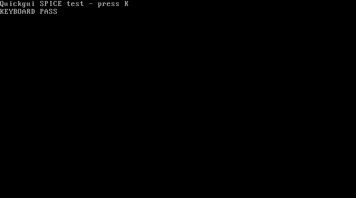

# Intel Mac의 SPICE backend 검증

2026-09-08. Homebrew QEMU 11.1.1에는 SPICE 서버가 포함되지 않아 공식 소스로
별도 backend를 만들었다. Quickgui 공통 수정과 개인 호스트의 backend 준비를 구분한다.

## 앱 수정

- 공통 `pr/spice-unix`, `integration/stabilization`, `pr/functional-regressions`: `ae57d7d`.
- 개인 `personal/preview`: `09fce12`.
- Quickemu 4.9.9의 기본 로컬 SPICE는 `.ports`에 `unix,<socket path>`를 기록한다.
  앱은 TCP `spice,<port>`만 읽어 연결 버튼을 활성화하지 못했다.
- 실제 Unix 소켓을 확인하고 상대 경로를 config 폴더 기준으로 해석한다. 공백,
  쉼표, `%`, 한글 경로를 보존한다. spice-gtk는 `spice+unix://` 뒤를 원문 경로로
  읽으므로 일반 URI percent encoding을 적용하지 않는다.
- 기존 Manager 연결 행과 버튼을 사용한다. 클릭 직전에 config, PID와 실행 상태를
  다시 조회하며 없어진 소켓에는 접속하지 않는다. 기존 TCP 연결은 유지한다.
- 공통 30 tests, 개인 43 tests와 양쪽 정적 분석 PASS. 개인 macOS release 앱
  46.8 MB, runner/App.framework의 x86_64·arm64 slice 확인.
- [공통 빌드 CI](https://github.com/kimdongup/quickgui/actions/runs/34262907080),
  [공통 실제 backend CI](https://github.com/kimdongup/quickgui/actions/runs/34262907061),
  [개인 빌드 CI](https://github.com/kimdongup/quickgui/actions/runs/34263261231),
  [개인 실제 backend CI](https://github.com/kimdongup/quickgui/actions/runs/34263261290): 모두 PASS.

## 서버와 QEMU

공식 [SPICE 다운로드](https://www.spice-space.org/download.html)의 0.16.0과
[QEMU 11.1.1](https://download.qemu.org/qemu-11.1.1.tar.xz)을 사용했다. 기록한 SHA256:

| 소스 | SHA256 |
| --- | --- |
| spice-0.16.0.tar.bz2 | `0a6ec9528f05371261bbb2d46ff35e7b5c45ff89bb975a99af95a5f20ff4717d` |
| qemu-11.1.1.tar.xz | `079ffbff8a7111bbc89022107cbabf3bbfd614d5fc9d7cc675991196aca12482` |

SPICE는 공식 HTTPS 파일의 로컬 체크섬을 기록했고, QEMU는 Homebrew 공식 formula의
체크섬과도 일치했다. 별도 서명 검증을 수행했다는 뜻은 아니다.

소스 변경 없이 SPICE의 autotools `configure`를 사용했다. Meson 경로는 Darwin에
없는 `librt`를 필수로 요구하지만 autotools는 선택적으로 검사한다. 임시 Python
venv에 pyparsing 3.3.2를 설치했다. 두 소스 모두 별도의 build 폴더에서 실행했다.

```sh
# SPICE 소스 안의 build 폴더. prefix는 전용 경로를 지정한다.
PYTHON=/private/tmp/quickgui-spice-build/venv/bin/python ../configure \
  --prefix=/private/tmp/quickgui-spice-build/prefix \
  --enable-gstreamer=no --with-sasl=no --enable-smartcard=no \
  --enable-manual=no --disable-static
make -j2
make -j2 check
make install

# QEMU 소스와 형제 관계인 qemu-build 폴더
PKG_CONFIG_PATH=/private/tmp/quickgui-spice-build/prefix/lib/pkgconfig \
  ../qemu-11.1.1/configure --target-list=x86_64-softmmu \
  --prefix=/private/tmp/quickgui-spice-build/qemu-prefix \
  --enable-spice --enable-slirp --enable-hvf --enable-cocoa --enable-coreaudio \
  --disable-docs --disable-werror --disable-gtk --disable-sdl \
  --disable-opengl --disable-virglrenderer --disable-guest-agent
ninja -j2 qemu-system-x86_64
```

SPICE 제공 테스트는 common 7 + server 18, 총 25 PASS. QEMU에서 SPICE server
0.16.0, HVF, Cocoa, slirp 지원과 `-spice help`, 코드 서명을 확인했다.

보존 경로는 `/Users/mac/quickemu/validation/spice-backend`다. `bin/quickemu`는 CPU
감지 패치가 적용된 검증 사본을 사용하고 이 폴더의 QEMU만 선택한다. QEMU와 SPICE
dylib 사본의 연결 경로를 상대 경로로 바꾸고 QEMU를 hypervisor entitlement로
ad-hoc 재서명했다. 실행기 두 개는 ShellCheck 경고 0이며 `manifest.json`에 체크섬을
보관했다. 시스템 `/usr/local/bin/qemu-system-x86_64`는 교체하지 않았다.

이 파일 묶음은 현재 Intel 호스트용이다. 기존 Homebrew 공유 라이브러리와
`/usr/local/share/qemu` 펌웨어를 사용하므로 다른 Mac에 그대로 배포할 수 있는
독립 패키지가 아니다. 바이너리는 Git 저장소에 포함하지 않는다.

## 실접속 증거와 범위

[재현 도구](../../tool/spice/README.md)는 256 MiB RAM, 새 16 MiB 검사 디스크와
vmware-svga를 사용한다. SPICE가 받은 720×400 화면을 저장하고 연결을 끊은 뒤 다시
접속했다. K 입력 후 게스트 메모리 `0x500`이 0에서 1로 바뀌었으며 수신 화면에
`KEYBOARD PASS`가 표시됐다. 실제 spicy의 main/display/inputs/cursor 채널도 확인했다.



초기에는 spice-gtk 0.42/GStreamer 1.28.6의 플러그인 검색 때문에 짧은 접속 검사
시간을 초과했다. 프로세스 샘플과 플러그인 로그에서 검색이 진행 중임을 확인했다.
275개 플러그인의 별도 전체 캐시 생성은 약 166초 뒤 exit 0으로 완료됐다.
검색을 끈 진단 환경에 이어 **전체 캐시와 보존한 QEMU**에서도 화면·키 입력·재접속·
실제 spicy 채널 검사가 통과했다. 앱이 코덱 검색을 끄도록 변경하지 않았다.
[GStreamer의 캐시/검색 환경 변수](https://gstreamer.freedesktop.org/documentation/gstreamer/running.html)를
검증 프로세스에만 사용했다.

이후 기본 캐시 초기화도 16.7초에 exit 0으로 완료됐으며 `--registry`나
`--display-only` 없이 **기본 환경**에서 동일 검사가 통과했다. 검색 로그에는 일부
Python GI/GTK 플러그인 경고도 있으므로 모든 멀티미디어 플러그인의 정상 동작까지
검증했다는 뜻은 아니다.

실행 중 검사 VM을 앱의 실제 `VmRepository.inspect/list` 및 SPICE 인자 생성으로
읽는 검사도 PASS. config bytes는 변하지 않았다. 이는 설치된 macOS/Windows의
바탕화면·SSH·클립보드·파일 전송·오디오·USB 실사용 검증을 대신하지 않는다.

2026-09-10 실제 게스트 준비에서 위 backend의 Quickemu도 Darwin에서는 `cocoa`와
`none`만 허용하는 것을 확인했다(`libexec/quickemu`의 `display_param_check`). 따라서
전용 QEMU가 SPICE를 지원해도 config의 `display="spice"`만 바꾸는 절차는 작동하지 않는다.

설치된 게스트의 검증은 정상 종료 후, 설치 완료 부팅에 사용한 QEMU 인자를 보존한 별도
실행 스크립트에서 전용 QEMU·`-display none`·권한 700 폴더의 Unix SPICE 소켓을 지정한다.
기존 CPU·화면 장치·OpenCore·NVRAM·시스템 디스크를 유지하며 SSH 전달은 loopback으로
제한한다. 원본 config에 남아 있는 RecoveryImage를 다시 연결하지 않는지 확인한다.
실행 중인 Cocoa VM의 디스크를 다른 QEMU에서 동시에 열지 않는다.

이 직접 QEMU 실행은 호스트 검증 절차다. Quickgui의 일반 Run이 SPICE backend까지
자동 설정한다는 의미는 아니다. 기존 `tool/spice/capture.c`는 실제 게스트의 화면·입력·
재접속 관찰에 재사용하며, 폐기용 검사 VM을 만드는 `smoke.py`는 반복 실행하지 않는다.
Windows ARM64 검증은 macOS Intel 단계의 결과 확정 후 진행한다.

## 설치된 Intel macOS 게스트 검증 — 2026-09-10 HST / 2026-09-11 UTC

앞의 폐기용 검사 VM 결과에 이어, 사용자가 설치·구동을 확인한 macOS 게스트에서
SSH와 SPICE를 실제 검증했다. 아래는 현재까지 확인한 결과다. 실제 spicy 창의 직접
입력은 호스트 화면 잠금으로 미확인이며, 프로토콜 입력·viewer 재접속·임시 키 정리와 구분한다.

### 기존 설치 상태 보존과 SPICE 부팅

Cocoa 게스트를 정상 종료했고 기존 QEMU 프로세스의 exit 0을 확인했다. 종료된 시스템
디스크의 `qemu-img check`도 통과했다. 같은 설치 디스크·OpenCore·NVRAM을 사용하며
RecoveryImage는 부착하지 않았다. 전용 SPICE QEMU는 위의 별도 실행 스크립트로 시작했다.
기존 VM을 재설치하거나 동시에 두 QEMU에서 디스크를 열지 않았다.

SPICE로 부팅한 뒤 SSH 명령은 exit 0이었으며 게스트의 macOS `15.7.9`, build `24G830`,
`x86_64`를 확인했다. 게스트 boot UUID가 이전 Cocoa 실행과 달라져 새 부팅임을 확인했다.
UUID 원문은 공개 기록에 포함하지 않는다.

이 과정에서 호스트에 약 30분의 `DarkWake`/`ThermalEmergency` 구간이 있었다. 이 호스트
기록이 포함된 전체 경과 시간을 VM의 부팅 시간이나 SPICE backend의 성능 측정값으로
해석하지 않는다.

### 확인 결과

| 항목 | 결과와 근거 |
| --- | --- |
| Cocoa 부팅의 SSH | **PASS**. Remote Login UI를 활성화한 뒤 제한된 임시 키로 실제 인증·게스트 명령 실행. 연결 종료 후 새 세션의 재인증·명령 exit 0 |
| SPICE 부팅 후 SSH | **PASS**. 설치된 게스트에 인증 후 OS·build·아키텍처 명령 exit 0. 이전 Cocoa 부팅과 다른 boot UUID 확인 |
| 설치 게스트 화면 수신 | **PASS**. 기존 `tool/spice/capture.c`의 실제 SPICE 연결로 1920×1080 바탕화면과 Terminal 화면 수신 |
| SPICE 키보드 입력 | **PASS**. capture 도구의 `--send-k` 입력 후 수신 화면에서 `QUICKGUI_SPICE_KEY=k` 확인 |
| SPICE 포인터·클릭 | **PASS**. 로컬 `mouse_capture`로 SPICE 절대 좌표 이동·왼쪽 클릭을 전송하여 Settings 뒤의 Terminal을 다시 활성화한 화면 확인 |
| 앱의 실제 실행 상태 조회 | **PASS**. 최신 앱 소스의 live 검사 1개 통과. 실제 `VmRepository.inspect/list`가 실행 중 QEMU PID `60671`, SSH 포트 `22220`, Unix SPICE 소켓을 인식 |
| 앱의 연결 준비 | **PASS**. 같은 live 검사에서 `detectSsh` 성공과 `spiceArguments`의 Unix 소켓 인자를 확인. 검사 전후 원본 config bytes 동일 |
| SPICE 프로토콜 재접속 | **PASS**. capture 클라이언트가 끊어진 뒤 별도 클라이언트가 같은 바탕화면을 수신하고 포인터 입력에 반응. 연결이 없는 동안에도 QEMU는 running |
| 실제 spicy 프로세스 종료·재접속 | **PASS: 연결·화면 데이터 수신 범위**. viewer PID `63052`만 종료한 뒤 QEMU `60671` 유지와 빈 채널을 확인했다. 새 viewer `64131`의 다른 connection ID로 main/display/inputs/cursor가 복구됐다. debug 로그에서 primary canvas 생성·1920×1080 monitor·display mark 수신 확인 |
| 실제 spicy 창의 직접 입력 | **BLOCKED: 호스트 화면 잠금**. `CGSSessionScreenIsLocked=true`, 디스플레이 전원 상태 0을 확인했다. 해당 viewer에 보낸 호스트 키 이벤트는 게스트 입력으로 이어지지 않았다. 실제 창의 키·마우스 수동 조작을 PASS로 처리하지 않는다 |
| 임시 인증 자료 정리 | **PASS**. 검증용 authorized_keys 한 줄만 제거하는 SSH 명령 exit 0. 다른 키 줄을 보존하고 호스트 임시 개인 키도 삭제했다. 게스트 Remote Login은 활성 상태로 유지 |

`mouse_capture`는 이번 로컬 관찰 도구이며 배포된 앱 기능이 아니다. capture 도구가 받은
실제 SPICE 프레임과 입력 반응은 설치 게스트의 프로토콜 검증 근거다. 실제 spicy 창의
사용자 입력·재접속 검증은 위의 별도 항목으로 완료 여부를 관리한다.

실제 spicy의 스택은 정상 GTK/AppKit 이벤트 대기였고, 접근성·이벤트 전송·화면 캡처
권한 조회는 허용 상태였다. 창 목록에 표시된다는 사실이나 채널 연결만으로 직접 창
입력을 통과 처리하지 않았다. 호스트 잠금 해제를 요청했으며, 잠금·보안 설정을 변경하지
않았다. QEMU의 virtio-sound 입력 경고, Unix 소켓의 `TCP_NODELAY` 경고와 spicy의
`CVDisplayLink` 초기화 경고도 관찰했다. 오디오가 정상이라는 의미는 아니다.

확인 시각과 범위를 [정리한 JSON](evidence/intel-macos-connections.json)에 기록했다.
원본 로그·게스트 화면은 Intel의 `/private/tmp/quickgui-intel-connections-yghh3lvw`에
있으며 공개 JSON에는 암호·키·실제 boot UUID를 포함하지 않았다. 화면 파일도 공개하지 않았다.

### 앱 연동 범위와 남은 제한

이번 실행은 CLI에서 검증용 스크립트로 전용 QEMU를 시작한 뒤, Quickgui 소스의 실제
조회·SSH 감지·SPICE 인자 생성 서비스를 그 VM에 적용한 검사다. 앱의 일반 Run 버튼이
전용 SPICE backend를 선택해 부팅하거나 원본 config의 `display="spice"`를 처리하도록
연동한 것은 아니다. 앞서 확인한 Darwin Quickemu의 display 제한도 그대로 남아 있다.

따라서 이번 서비스 검사 성공을 앱 GUI의 전체 실행·접속 흐름 검증으로 확대하지 않는다.
VM과 재접속한 spicy viewer는 실행 상태로 유지했다. 현재 `.ports`는 SSH `22220`과
실행 중 Unix SPICE 소켓을 가리킨다. 원본 config·생성된 설치 부팅 스크립트·OpenCore·
NVRAM의 bytes와 inode, 시스템 디스크의 inode는 보존됐다. 시스템 디스크 내용은 정상적인
게스트 실행과 SSH 설정에 따라 변경됐다. 검증용 실행기·소켓은 위 임시 폴더에 있으며
일반 Run의 영속 SPICE 설정으로 저장한 것은 아니다. 이후 다시 부팅할 때 원본 config의
Recovery 항목을 그대로 실행하지 말고 설치 부팅 인자를 확인해야 한다.

남은 Intel 항목은 호스트 잠금 해제 후 실제 spicy 창 입력과 앱 GUI의 전체 접속 흐름이다.
Windows ARM64는 사용자 요청에 따라 [맥미니 기존 Codex로 인계](M1_WINDOWS_CONNECTION_HANDOFF.ko.md)한다.
오디오·클립보드·파일 전송·USB 및 Windows ARM64의 SPICE 성공 여부는 이번 결과에 포함하지 않는다.
